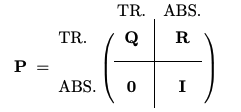

## Discrete-Time Markov Chain Model for 3-State Health States

## The Bayesian Model

The Bayesian is a simple [conjugate prior model](https://en.wikipedia.org/wiki/Conjugate_prior) with a Multinomial likelihood function and [Dirichlet distribution](https://en.wikipedia.org/wiki/Dirichlet_distribution)) prior. Because these two distributions are conjugate, the posterior distribution will also be a Dirichlet. 

The Dirichlet distribution] is a multivariate generalization of the beta distribution, which is parameterized by a vector of positive real numbers and is defined over a simplex a generalization of the concept of a triangle to higher dimensions. The probability density function (PDF) of the Dirichlet distribution is given by:

$$ p(x) = \dfrac{\Gamma(\alpha_0)}{\Gamma(\alpha_1)...\Gamma(\alpha_n)} \prod_{i = 1}^{n}x_i^{\alpha_i - 1}I(x \in S)$$ 

where $\alpha_0 = \sum_{i=1}^{n} \alpha_i$, $I(x)$ is the indicator function, $\Gamma$ is the gamma function, and the simplex $S = x \in \mathbb{R}^n: x_i > 0, \sum_{i=1}^{n} x_i = 1$ is the space of probability distributions. You can think of the Dirichlet distribution as a distribution of probability distributions. It models proportions or probabilities that sum to one, such as the transition probabilities in a Markov chain, and is often used as a prior distribution in Bayesian models since it is conjugate with the Multinomial distribution. (See Tufts in the references below.). The parameters of the Dirichlet posterior distribution are the vector sum of the prior parameters and the observed counts. When the $\alpha_i$ parameters are all equal, the Dirichlet distribution is symmetric and uniform over the simplex. When the parameters are unequal, the distribution is skewed towards the larger parameters. In the code below, the $\alpha_i$ parameters are set to 1.


```{r}
#| message: FALSE
#| warning: FALSE
#| code-fold: TRUE
#| code-summary: "R Packages"
library('dplyr')
library('ggplot2')
library('stringr')
library('tidyverse')
library('matrixcalc')
library('LaplacesDemon') # for Dirichlet distribution
library('diagram')
library('expm') # for matrix exponentiation
library('ctmcd') # for continuous-time Markov chain models
```


```{r}
#| message: FALSE
#| warning: FALSE
#| code-fold: TRUE
#| code-summary: "Helper Functions Code"
# names for transition probabilities
trans_names <- function(x) {
  transitions <- paste(x, "-", 1:5, sep = "")
  return(transitions)
}


sim_res <- function(matrix, from_state, n_sims = 20000) {
  # Bayesian simulation using Dirichlet conjugate prior
  # matrix is the matrix of observed states
  # from_state is the row index of the initial state
  # n_sims is the number of simulations to run
  priors <- matrix(rep(1, 6), nrow = 3) # Prior parameters for Dirichlet dist HERE
  dist <- matrix[from_state, ] + priors[from_state, ]
  res <- rdirichlet(n_sims, dist)
  colnames(res) <- paste(from_state, "-", 1:3, sep = "")
  return(res)
}

smry <- function(res_matrix) {
  apply(res_matrix, 2, function(x) {
    c(
      mean = mean(x),
      lower = quantile(x, probs = 0.025),
      upper = quantile(x, probs = 0.975)
    )
  })
}

plot_row_dist <- function(matrix, treatment, start_state) {
  # code to plot the posterior marginal distributions
  # Inputs:
  # matrix the simulation matrix for the health state of interest
  # treatment: either Seretide or Fluticasone as a character
  # start_state: name of health state that agrees with matrix as a character
  treatment <- treatment
  start_state <- start_state
  plot_df <- matrix %>%
    as.data.frame() %>%
    pivot_longer(cols = everything(), names_to = "transitions", values_to = "prob")

  ggplot(plot_df, aes(x = prob)) +
    geom_histogram(aes(y = after_stat(density)), bins = 15, fill = "lightgrey", color = "black") + # histogram for each category
    geom_density(aes(y = after_stat(density)), color = "red", linewidth = 0.5) + # density line
    scale_x_continuous(breaks = scales::pretty_breaks(n = 5)) +
    xlab("probability") +
    facet_wrap(~transitions, scales = "free") + # faceting for each category
    labs(x = "Probability", y = " ") +
    ggtitle(paste(treatment, ": Posterior State Transition Probabilities for states starting in", start_state))
}


# Function to compute the probability of being in each state at time t
prob_at_time <- function(matrix, time, i_state) {
  u <- i_state
  index_eq_1 <- which(u == 1)
  m <- matrix.power(matrix, time)
  u_t <- u %*% m # Distribution at time t
  rownames(u_t) <- names(states)[index_eq_1]
  round(u_t, 2)
}


time_in_state2 <- function(tpm, n){
  # Function to compute the expected time spent in each state
  # tpm - the transition probability matrix
  # n - the number of time periods
  I <- diag(3) # Initial state vectors
  s_time <- matrix(0, nrow = 3, ncol = 3)
  m <- matrix(0, nrow = 3, ncol = 3)
  for (i in 1:3) {
    for (j in 1:n) {
      m[i, ] <- I[i, ] %*% matrix.power(tpm, j)
      s_time[i, ] <- s_time[i, ] + m[i, ]
      colnames(s_time) <- c("STW", "UTW", "TF")
      rownames(s_time) <- c("STW", "UTW", "TF")

  }}
  return(s_time)
}
```


```{r}
#| message: FALSE
#| warning: FALSE
#| code-fold: TRUE
#| code-summary: "Data Input Code"
states <- c(
  "STW" = "sucessfully treated week",
  "UTW" = "unsucessfully treated week",
  "TF" = "treatment failure"
)

treatments <- c("Seretide", "Fluticasone")

# s_state <- matrix(
#   c(
#     210, 60, 0, 1, 1,
#     88, 641, 0, 4, 13,
#     0, 0, 0, 0, 0,
#     1, 0, 0, 0, 1,
#     0, 0, 0, 0, 81
#   ),
#   nrow = 5, byrow = TRUE,
#   dimnames = list(names(states), names(states))
# )

s_state <- matrix(
  c(
    210,  61,  1,
     89, 645, 14,
     0,    0, 81
    ),  
    nrow=3, ncol=3, byrow=TRUE,
   dimnames = list(names(states), names(states))
)

# f_state <- matrix(
#   c(
#     66, 32, 0, 0, 2,
#     42, 752, 0, 5, 20,
#     0, 0, 0, 0, 0,
#     0, 4, 0, 1, 0,
#     0, 0, 0, 0, 156
#   ),
#   nrow = 5, byrow = TRUE,
#   dimnames = list(names(states), names(states))
# )

 f_state <- matrix(
  c(
    66, 32, 2,
    42, 762, 20,
    0, 0, 156
  ),
  nrow = 3, ncol = 3, byrow = TRUE,
  dimnames = list(names(states), names(states))
)


```


### Serentide Simulations
```{r}
#| message: FALSE
#| warning: FALSE
#| code-fold: TRUE
#| code-summary: "Serentide Simulation Code"
s_STW_sim <- sim_res(matrix = s_state, from_state = 1)
s_STW_smry <- smry(s_STW_sim)

s_UTW_sim <- sim_res(matrix = s_state, from_state = 2)
s_UTW_smry <- smry(s_UTW_sim)

plot_row_dist(matrix = s_STW_sim, treatment = "Seretide", start_state = "STW")
```

### Fluticaseon Simulations

```{r}
#| message: FALSE
#| warning: FALSE
#| code-fold: TRUE
#| code-summary: "Flucticone Simulation Code"
f_STW_sim <- sim_res(matrix = f_state, from_state = 1)
f_STW_smry <- smry(f_STW_sim)

f_UTW_sim <- sim_res(matrix = f_state, from_state = 2)
f_UTW_smry <- smry(f_UTW_sim)

# code for histogram of rd_df data frame
plot_row_dist(matrix = f_STW_sim, treatment = "Fluticasone", start_state = "STW")
```

### Transition Probabilities

```{r}
#| message: FALSE
#| warning: FALSE
#| code-fold: TRUE
#| code-summary: "Transition Probabilities Code"

# Seretide transition Probabilities
s_TP <- rbind(
  s_STW_smry[1, ],
  s_UTW_smry[1, ]
  )

s_TP <- rbind(s_TP, c(0, 0, 1)) # Add the absorbing state TF
colnames(s_TP) <- c("STW", "UTW", "TF")
rownames(s_TP) <- c("STW", "UTW", "TF")
# s_TP

# Fluticasone transition Probabilities
f_TP <- rbind(
  f_STW_smry[1, ],
  f_UTW_smry[1, ]
  
)
f_TP <- rbind(f_TP, c(0, 0, 1)) # Add the absorbing state TF
colnames(f_TP) <- c("STW", "UTW", "TF")
rownames(f_TP) <- c("STW", "UTW", "TF")
```


:::: {.columns}

::: {.column width="45%"}


```{r}
#| code-fold: TRUE
#| code-summary: "Serentide Transition Probabilities"
round(s_TP, 2)
```
:::

::: {.column width="10%"}

:::

::: {.column width="45%"}


```{r}
#| code-fold: TRUE
#| code-summary: "Flucticone Transition Probabilities"
round(f_TP, 2)
```
:::


::::

### The Fundamental Matrix
For an absorbing Markov Chain, each entry $n_{ij}$ of the fundamental matrix, $N$, gives the expected number of times the process is in state $s_j$ given that it starts in state $s-i$.  For our example, this corresponds to the number of weeks that a patient is expected to spend in each of the transient states before reaching the absorbing state, *TF*. 

The first step in getting to $N$ is to partition the transition matrix into sub-matrices of $Q$ of transient state transition probabilities, and  $R$, absorbing state transition probabilities as illustrated in the figure below. If there are $q$ transitive states and $r$ absorbing state, $Q$ is a $q \times q$ matrix, $R$ is a $q \times r$ matrix, $0$ is a $r \times q$ matrix, and $I$ is a $r \times r$ identity matrix. The figure is reproduced from Professor Nickolay Atanasov's *Chapter 11* notes on Markov chains [1] which presents lucid account of the theory presented here.

 



Calculating $N = (I - Q)^{-1}$ involves computing the inverse of the matrix $I - Q$ which is easy enough to do in `R`. Remember each entry $n_ij$ of N gives the expected number of times that an absorbing process is expected to be in the transient state $s_j$ before absorption, given that it starts in state $s_i$. So, given that patients start in health state `STW`, the expected number of weeks that patients are expected to spend in the various states before treatment failure are given by the first rows of $N_s$ and $N_f$ respectively. 


### Extract the Fundamental Matrix

```{r}
#| code-fold: TRUE
#| code-summary: "Show the code"
Q_s <- s_TP[1:2, 1:2] # Extract the sub-matrix of transition probabilities for non-absorbing states

rownames(Q_s) <- names(states)[1:2]
colnames(Q_s) <- names(states)[1:2] # Set the row and column names to the state names
# round(Q_s,3)

Q_f <- f_TP[1:2, 1:2] # Extract the sub-matrix of transition probabilities for non-absorbing states

rownames(Q_f) <- names(states)[1:2]
colnames(Q_f) <- names(states)[1:2] # Set the row and column names to the state names
# round(Q_f,3)

I <- diag(2) # Identity matrix of size 3
N_s <- solve(I - Q_s) # Fundamental matrix for Seretide
# round(N_s,3)

N_f <- solve(I - Q_f) # Fundamental matrix for Fluticasone
# round(N_f,3)
```


:::: {.columns}

::: {.column width="45%"}


```{r}
#| code-fold: TRUE
#| code-summary: "Serentide Fundamental Matrix"
round(N_s, 3)
```

:::

::: {.column width="10%"}

:::

::: {.column width="45%"}


```{r}
#| code-fold: TRUE
#| code-summary: "Flucticonse Fundamental Matrix"
round(N_f, 3)
```

:::


::::

### Expected time to Absorption

The expected time to absorption from each transient state is the sum of the expected number of times the process visits each transient state before absorption occurs. It is given by the formula $t = Nc$, where $c$ is a vector of ones. This is a useful measure for any healthcare economics study as the monetary costs and [QALYS](https://en.wikipedia.org/wiki/Quality-adjusted_life_year) assigned to each state determine the cost-effectiveness of a treatment.


```{r}
#| code-fold: true
#| code-summary: "Show the code"
# Calculation for Seretide
c <- c(1,1)
E_s <- N_s %*% c # Expected time to absorption for Seretide
colnames(E_s) <- "Seretide"

#Calculation for Fluticasone
E_f <- N_f %*% c # Expected time to absorption for Fluticasone
colnames(E_f) <- "Fluticasone"

# Combine the expected times to absorption for both treatments
E <- cbind(E_s, E_f) %>% data.frame()
round(E,2)
```

### Distribution at time t

Probability of being in each state at time t starting from state STW as given by $P(s = i | time = t) = uP^t$ where $u$ is the initial state vector, and $P$ is the transition probability matrix. To provide a specific example, the following code calculates the probability of patients being in the health state `STW` at week 13, the week after the follow up period of the study, given that they started in `STW`.

```{r}
#| code-fold: true
#| code-summary: "Show the code"
# Seretide
t <- 13
u <- c(1, 0, 0) # Initial state vector, starting in STW
spt <- prob_at_time(s_TP, t, u)

# Fluticasone
t <- 13
u <- c(1, 0, 0) # Initial state vector, starting in STW
fpt <- prob_at_time(f_TP, t, u)


p_in_state <- rbind(spt, fpt)
rownames(p_in_state) <- c("Seretide start STW", "Fluticasone start STW")
p_in_state
``` 

### Plot Survival Curves

From here, it is trivial to compute the probability that patients will not be in the absorption state as time progresses and plot a standard survival curve.

```{r}
#| code-fold: true
#| code-summary: "Show the code"
N <- 99 # weeks
s_surv_dat <- vector("numeric", length = N)
f_surv_dat <- vector("numeric", length = N)

u <- c(1, 0, 0) # Initial state vector, starting in STW
for (t in 1:N) {
  s_dist <- prob_at_time(s_TP, t, u)
  s_surv_dat[t] <- sum(s_dist[1:2]) # Sum of probabilities of being in transient states)
  f_dist <- prob_at_time(f_TP, t, u)
  f_surv_dat[t] <- sum(f_dist[1:2]) # Sum of probabilities of being in transient states
}

survival_df <- data.frame(
  time = 1:N,
  s_prob = s_surv_dat,
  f_prob = f_surv_dat
)

survival_df_l <- survival_df %>%
  pivot_longer(
    cols = c(s_prob, f_prob),
    names_to = "treatment", values_to = "probability"
  ) %>%
  mutate(treatment = recode(treatment, s_prob = "Seretide", f_prob = "Fluticasone"))

ggplot(survival_df_l) +
  geom_line(aes(
    x = time, y = probability, group = treatment,
    color = treatment
  ), linewidth = 1.5) +
  labs(
    title = "Probability of being in transient states over time",
    x = "Time (weeks)",
    y = "Probability"
  ) +
  scale_x_continuous(breaks = seq(0, N, by = 5)) +
  scale_y_continuous(labels = scales::percent_format(scale = 1))
```

The curves clearly suggest that Seretide would be the preferred treatment.

### Expected time spent in selected state

This section of code computes a matrix that provides the expected time the Markov chain will spend in each state up to some time n. Each row of the matrix assumes the process starts in the state designated by the row name. The entry for each column of that row is the expected time spent in that state up to time n. Matrices are computed for both Seretide and Fluticasone.


Note that in a healthcare cost-effectiveness model, these times could be used to compute the financial and quality of life costs for patients who survive to n weeks.

```{r}
#| code-fold: true
#| code-summary: "Show the code"
n <- 13

s_state_times <- time_in_state2(tpm = s_TP, n = n)
f_state_times <- time_in_state2(tpm = f_TP, n = n)
```


:::: {.columns}

::: {.column width="45%"}

```{r}
#| code-fold: true
#| code-summary: "Seretide: time in states at n weeks"
# Seretide
cat("at n = ", n, "\n")
round(s_state_times, 2)

```


:::

::: {.column width="10%"}

:::

::: {.column width="45%"}


```{r}
#| code-fold: true
#| code-summary: "Fluticasone: State times at n weeks"
# Fluticasone
cat("at n = ", n, "\n")
round(f_state_times, 2)

```

:::


::::


Here, for both treatments, we compute the total time the chain spends in the transient states, assuming that the process starts in `STW`. These times agree nicely with the expected time to absorption computed above.

```{r}
#| code-fold: true
#| code-summary: "Show the code"
# Seretide
s_time_in_STW <- sum(s_state_times[1,1:2]) # Exclude the absorbing state TF
f_time_in_STW <- sum(f_state_times[1,1:2]) # Exclude the absorbing state TF
time_in_STW <- data.frame(
  Seretide = s_time_in_STW,
  Fluticasone = f_time_in_STW
)
round(time_in_STW,2)
```

## Conclusions

I have constructed a very simple, Bayesian Markov Chain model to analyse the data for two arms of a clinical trial. This model should be relevant to any multi-state, time-to-event analysis where the data are given as state counts collected at regular intervals. In particular, the model should be helpful for analyzing disease progression data that meet these criteria. Coding the model with `R` from first principles is straight forward because `R` was designed for work with matrices, probability distributions, and Monte-Carlo simulations. 


## Continuous-Time Markov Chain Model


### 3 State Seretide example

```{r}
#| message: FALSE
#| warning: FALSE
#| code-fold: TRUE
#| code-summary: "Show the code"
s <- matrix(
  c(
    210,  61,  1,
     89, 645, 14,
     0,    0, 81
    ),  
    nrow=3, byrow=TRUE,
    dimnames = list(c("S1", "S2", "S3"), c("S1", "S2", "S3"))
)


s0 <- matrix(1, 3, 3)
diag(s0) <- 0
diag(s0) <- -rowSums(s0)
s0[3,] <- 0

sem <- gm(s, te=1, method="EM", gmguess=s0)
plot(sem)
```


### Generating Matrix (Q) and Transition Probability Matrix (P)

:::: {.columns}

::: {.column width="45%"}


```{r}
#| code-fold: TRUE
#| code-summary: "Q Matrix"
t <- 1  # time interval
Q  <-sem$par
round(Q,2)
cat("time = ", t, "\n")
```

:::

::: {.column width="10%"}

:::

::: {.column width="45%"}

```{r}
#| code-fold: TRUE
#| code-summary: "P matrix"
P <- expm(Q * t)
round(P,2)
cat("time = ", t, "\n")
```

:::


::::

### Transition Probabilities over Time

```{r}
#| message: FALSE
#| warning: FALSE
#| code-fold: TRUE
#| code-summary: "Show the Code"
Time <- seq(1,100)
TP <- matrix(0, nrow=length(Time), ncol=9)
for (t in Time) {
  P <- expm(Q * t)
  TP[t,1] <- P[1,1]
  TP[t,2] <- P[1,2]
  TP[t,3] <- P[1,3]
  TP[t,4] <- P[2,1]
  TP[t,5] <- P[2,2]
  TP[t,6] <- P[2,3]
  TP[t,7] <- P[3,1]
  TP[t,8] <- P[3,2]
  TP[t,9] <- P[3,3]
  
}

probs <- as.data.frame(TP)
TP <- cbind(Weeks = Time, probs)
names(TP) <- c("Weeks",
               "P[1,1]", "P[1,2]", "P[1,3]",
               "P[2,1]", "P[2,2]", "P[2,3]",
               "P[3,1]", "P[3,2]", "P[3,3]")
#head(TP)


df_long <- TP %>%
  pivot_longer(
    cols = starts_with("P["), # Selects all columns starting with "P["
    names_to = "TP",    # New column for the original column names
    values_to = "Value"        # New column for the values
  )

df_long |> ggplot(aes(x = Weeks, y = Value, color = TP)) +
  geom_line() +
  facet_wrap(~ TP, scales = "free_y") +
  labs(title = "State Transition Probabilities over Time",
       x = "Weeks", y = "Transition Probability")
```

## Appendix Data

The data used in this post originates from a four arm randomized trial comparing treatments for asthma management, including Seretide and Fluticasone, conducted by Kavuru et al. [3]. I report the data presented in the text by Welton et al. [5] and the paper by Briggs et al. [2]. The data comprise the number of patients in each of five health states at the end of each week for a 12-week follow-up period. The states are defined as follows: STW= successfully treated week, UTW= unsuccessfully treated week, Hex= hospital-managed exacerbation Pex= primary care-managed exacerbation, and TF= treatment failure.

## References

[1] Atanasov, N [Chapter 11: Markov Chains](https://natanaso.github.io/ece276b/ref/Grinstead-Snell-Ch11.pdf)

[2] Briggs AH, Ades AE, Price MJ. [Probabilistic Sensitivity Analysis for Decision Trees with Multiple Branches: Use of the Dirichlet Distribution in a Bayesian Framework. Medical Decision Making](https://journals.sagepub.com/doi/abs/10.1177/0272989X03255922), 2003


[3] Kavuru M, Melamed J, Gross G, Laforce C, House K, Prillaman B, Baitinger L, Woodring A, and  Shah T, (2000) [Salmeterol and fluticasone propionate combined in a new powder inhalation device for the treatment of asthma: a randomized, double-blind, placebo-controlled trial](https://pubmed.ncbi.nlm.nih.gov/10856143/)


[4] Tufts, C. [The Little Book of LDA](https://miningthedetails.com/LDA_Inference_Book/index.html)

[5] Welton NJ, Sutton AJ, Cooper NJ, Abrams KR, and Ades AE (2010) [Evidence Synthesis for Decision Making in Healthcare](https://www.cambridge.org/core/books/evidence-synthesis-for-decision-making-in-healthcare/3A2F7B1C4D5E6F8B9A1B0D2E3C4F5A6B). Cambridge University Press.